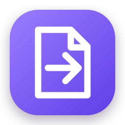

<div align="center">
  
  <h1>VersaConvert</h1>
  <p><strong>Ogni file, nel formato giusto. In locale.</strong></p>
  <p><a href="https://github.com/ImFeniceB/VersaConvert/actions/workflows/build.yml"></a></p>
</div>

VersaConvert è un convertitore di file desktop per Windows. Seleziona uno o più file, mostra solo i formati di uscita realmente compatibili e converte tutto sul computer, senza caricamenti su servizi esterni.

Il caso d’uso principale — **MP4 → MP3** — funziona direttamente nella build completa grazie a FFmpeg incorporato.

## Funzioni

- conversione in coda di uno o più file;
- trascinamento di file e cartelle nella finestra;
- elenco dinamico dei formati compatibili con tutti i file selezionati;
- picker dei formati con ricerca rapida;
- video, estrazione audio, immagini, testo e documenti Office;
- preset intelligenti e impostazioni mostrate solo quando sono rilevanti;
- preflight con destinazione, collisioni e motori richiesti prima dell'avvio;
- avanzamento per file, annullamento, apertura dell'output e nuovo tentativo sugli errori;
- scorciatoie da tastiera e feedback visivi rispettosi delle preferenze di Windows;
- elaborazione interamente locale;
- singolo eseguibile Windows x64, senza installazione di .NET.

## Formati supportati

| Sorgente | Formati di ingresso | Uscite principali | Motore |
|---|---|---|---|
| Video | MP4, MKV, MOV, AVI, WebM, WMV, FLV, M4V, MPEG, 3GP, TS/MTS | MP4, MKV, WebM, MOV, AVI, GIF, MP3, WAV, FLAC, M4A, OGG, Opus | FFmpeg incluso |
| Audio | MP3, WAV, FLAC, AAC, M4A, OGG, Opus, WMA, AIFF, ALAC, AC3 | MP3, WAV, FLAC, M4A, AAC, OGG, Opus | FFmpeg incluso |
| Immagini | PNG, JPEG, WebP, BMP, GIF, TIFF, ICO, AVIF, HEIC | PNG, JPEG, WebP, AVIF, BMP, TIFF, GIF | FFmpeg incluso |
| Testo | TXT, Markdown, HTML | TXT, Markdown, HTML | Interno |
| Documenti | DOC/DOCX, ODT, RTF | PDF, DOCX, ODT, RTF, TXT, HTML | LibreOffice opzionale |
| Fogli | XLS/XLSX, ODS, CSV | PDF, XLSX, ODS, CSV | LibreOffice opzionale |
| Presentazioni | PPT/PPTX, ODP | PDF, PPTX, ODP | LibreOffice opzionale |

La matrice completa e le limitazioni note sono in [docs/FORMATI.md](docs/FORMATI.md).

> “Ogni tipo” significa ogni trasformazione prevista dalla matrice di compatibilità. VersaConvert non propone conversioni tecnicamente possibili ma prive di senso, come un archivio ZIP trasformato in un brano MP3.

## Download e utilizzo

1. Scarica `VersaConvert.exe` dalla sezione **Releases** del repository.
2. Avvia l’EXE; non serve installare .NET o FFmpeg.
3. Trascina i file nella finestra oppure premi **Aggiungi file**.
4. Scegli il formato, la cartella e un preset; il preflight riepiloga il risultato.
5. Premi **Converti ora**.

Scorciatoie principali: `Ctrl+O` aggiunge file, `Ctrl+Invio` avvia la conversione, `Canc` rimuove il file selezionato ed `Esc` chiude il picker o annulla l'operazione in corso.

Windows potrebbe mostrare un avviso SmartScreen per una build non firmata. Il codice è pubblico e l’hash SHA-256 viene prodotto insieme a ogni release.

Per convertire documenti Word, Excel e PowerPoint è necessario installare [LibreOffice](https://www.libreoffice.org/download/download-libreoffice/). VersaConvert lo rileva automaticamente al riavvio.

## Privacy

I file non lasciano il computer. VersaConvert non contiene account, analytics, pubblicità o telemetria. I processi avviati sono esclusivamente i motori locali indicati nell’interfaccia.

## Compilazione

Requisiti per lo sviluppo:

- Windows 10/11 x64;
- [.NET SDK 8](https://dotnet.microsoft.com/download/dotnet/8.0);
- PowerShell 7 o Windows PowerShell 5.1.

```powershell
git clone https://github.com/ImFeniceB/VersaConvert.git
cd VersaConvert
dotnet test VersaConvert.sln -c Release
./scripts/build-release.ps1
```

Lo script recupera FFmpeg se necessario, esegue i test e crea:

- `dist/VersaConvert.exe` — applicazione autonoma;
- `artifacts/VersaConvert-win-x64.zip` — pacchetto con licenze;
- `artifacts/SHA256SUMS.txt` — checksum della build.

Per una compilazione rapida senza incorporare FFmpeg:

```powershell
dotnet build VersaConvert.sln -c Release
```

## Struttura

```text
src/VersaConvert.App       interfaccia WPF
src/VersaConvert.Core      catalogo, motori e processi
tests/                     test automatici e integrazione FFmpeg
scripts/                   download dipendenze e build release
docs/                      architettura, formati e roadmap
```

Consulta [docs/ARCHITECTURE.md](docs/ARCHITECTURE.md) per i dettagli tecnici e [CONTRIBUTING.md](CONTRIBUTING.md) per contribuire.

## Licenza

Il codice di VersaConvert è distribuito con licenza MIT. La build completa incorpora FFmpeg, distribuito separatamente secondo i termini GPL applicabili alla build utilizzata. Vedi [THIRD-PARTY-NOTICES.md](THIRD-PARTY-NOTICES.md).
