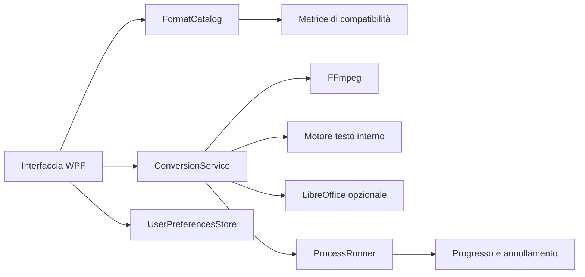

# Architettura

VersaConvert separa l’interfaccia Windows dalla logica di conversione. Il progetto `VersaConvert.Core` non dipende da WPF e può essere testato o riutilizzato da una futura CLI.

## Componenti

### FormatCatalog

Riconosce la famiglia a partire dall’estensione e restituisce le sole uscite consentite. `GetCommonOutputs` calcola l’intersezione per le code con più file.

### ConversionService

È il punto di ingresso unico. Verifica la compatibilità, sceglie il motore e normalizza gli errori in messaggi mostrabili all’utente.

### FfmpegCommandBuilder

Costruisce una lista di argomenti, non una stringa da shell. In questo modo percorsi con spazi o caratteri speciali non introducono problemi di quoting o injection.

### ProcessRunner

Avvia i motori senza shell e senza finestra console. Per FFmpeg legge `Duration` e `out_time` per calcolare il progresso. La cancellazione termina l’intero albero del processo e il servizio elimina l’output parziale.

### OutputPathResolver

Gestisce tre strategie: rinomina, sovrascrivi e salta. Se ingresso e uscita coincidono, aggiunge `_convertito` e non modifica mai il file sorgente.

### UserPreferencesStore

Salva soltanto le preferenze dell'interfaccia in `%APPDATA%\VersaConvert\settings.json`. La scrittura usa un file temporaneo e una sostituzione atomica; dati assenti, non validi o fuori intervallo vengono riportati a valori sicuri.

## Build autonoma

La pubblicazione .NET usa `PublishSingleFile`, runtime Windows x64 self-contained e compressione. `ffmpeg.exe` è un contenuto della pubblicazione e viene estratto automaticamente dal bundle .NET in una cartella temporanea all’avvio. `ToolLocator` lo cerca prima accanto all’app e poi nel `PATH`.

Il binario FFmpeg non è versionato nel repository, per motivi di dimensione e aggiornabilità. `scripts/fetch-ffmpeg.ps1` lo recupera durante la release.

## Errori e sicurezza dei dati

- il sorgente è sempre aperto in lettura;
- l’output viene scritto in un percorso distinto;
- gli argomenti dei processi sono passati con `ArgumentList`;
- un output parziale FFmpeg viene rimosso dopo errore o annullamento;
- nessun file viene caricato in rete;
- i file già esistenti seguono una scelta esplicita dell’utente.
